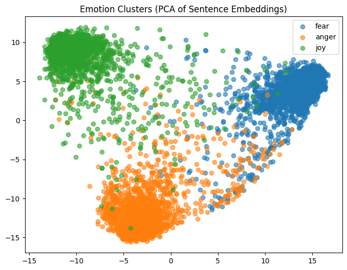
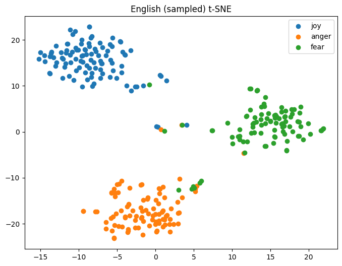
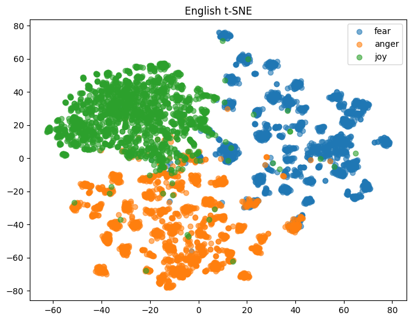
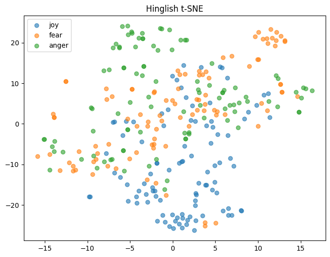

# emotion-embedding-analysis

## Overview

This project investigates whether modern sentence embeddings capture **emotional structure** in text, and how this behavior changes in **code-mixed language (Hinglish)**.

We compare:

* English dataset (~6000 samples)
* Hinglish dataset (~300 samples)

The central question:

> Do embedding models naturally separate emotions like *joy*, *fear*, and *anger*?

---

## Methodology

### Data Preprocessing

* Lowercasing text
* Removal of URLs
* Minimal cleaning to preserve Hinglish structure

### Embedding Model

We use:

* `j-hartmann/emotion-english-distilroberta-base`

This is an **emotion-specialized model trained primarily on English data**, making it a strong baseline for evaluating cross-lingual generalization.

---
### Dimensionality Reduction

* PCA (global linear structure)
* t-SNE (local non-linear structure)

---

### Clustering

* KMeans (k = 3, corresponding to emotions)

---

### Evaluation Metrics

* Crosstab analysis (cluster distribution vs true labels)
* Silhouette Score (cluster quality)

---

## Results

### English Dataset

* Clear cluster formation across emotions
* Strong alignment between clusters and labels

**Silhouette Score:**
→ **0.29 (moderate clustering quality)**

---

### Hinglish Dataset

* Significant overlap between emotion classes
* Poor cluster separation

**Silhouette Score:**
→ **0.12 (weak clustering quality)**

---

## Key Observations

1. Emotion-specific embeddings significantly improve clustering for English text.
2. Hinglish data shows:

   * Higher overlap between emotional categories
   * Reduced separability in embedding space
3. Visual patterns alone can be misleading when dataset sizes differ significantly.
4. Even with an emotion-aware model, embeddings do not fully capture emotional structure.

---

## Limitations

### 1. Model Bias (English-Centric Training)

The embedding model used is trained primarily on English data.
As a result:

* It performs well on English inputs
* It struggles to generalize to code-mixed Hinglish

---

### 2. Dataset Imbalance

* English: ~6000 samples
* Hinglish: ~300 samples

This imbalance affects:

* Visualization (t-SNE density differences)
* Clustering reliability
* Metric comparability

---

### 3. Nature of Embeddings

Sentence embeddings are optimized for **semantic similarity**, not explicitly for **emotion separation**, which limits clustering performance.

---

## 📷 Visualizations

### PCA

### t-SNE (Overall)

### English t-SNE

### Hinglish t-SNE

---

## Core Insight

> Emotion is not cleanly encoded in embedding space.

> Even specialized models struggle when applied to code-mixed language.

---

## Future Work

* Use multilingual or cross-lingual embedding models
* Increase Hinglish dataset size
* Explore alternative clustering methods (e.g., density-based)
* Replace t-SNE with more stable techniques like UMAP

---

## Conclusion

This study demonstrates that while emotion-aware models can effectively cluster English text, their performance degrades on code-mixed Hinglish. The results highlight both **model limitations** and **data-related challenges** in multilingual emotional representation.

---

## 👤 Author

Amtul Rahman Sadiya
